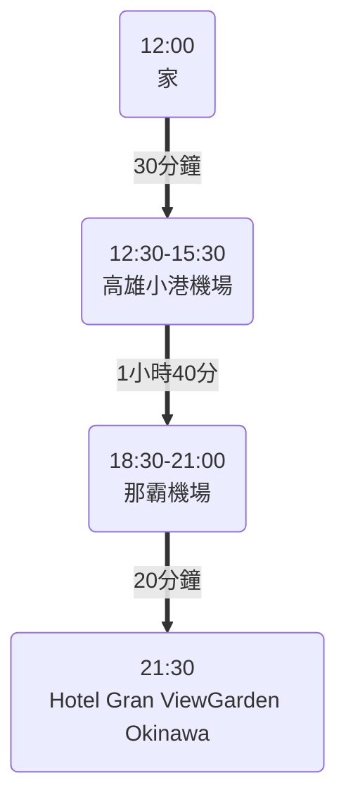
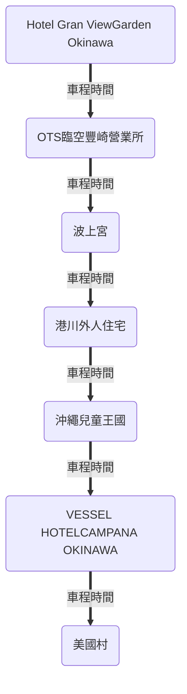
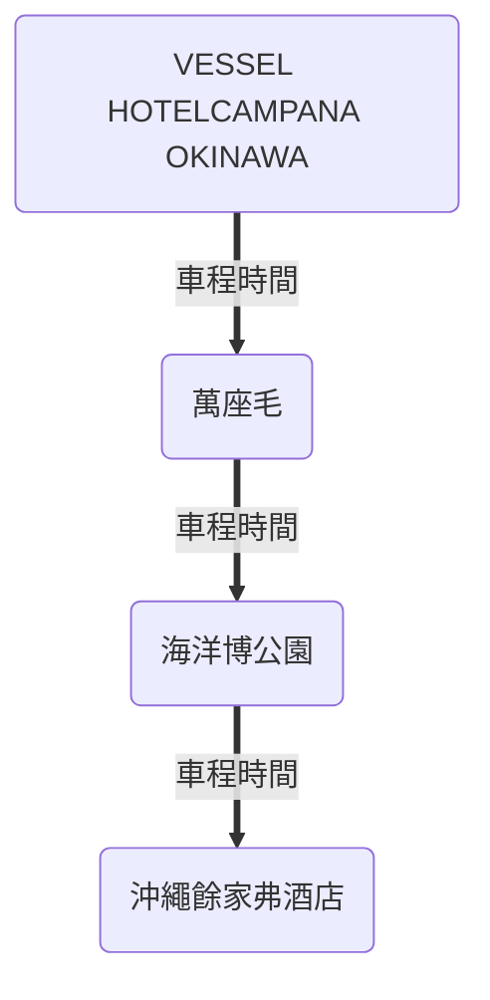
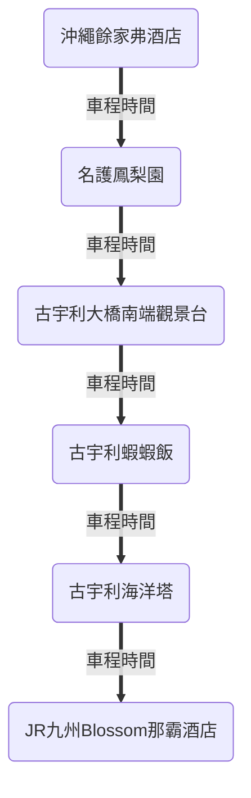
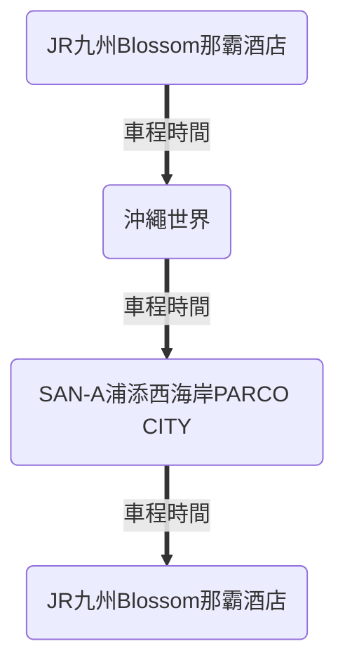
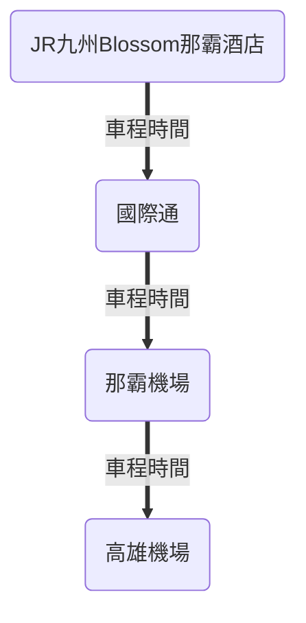

## 行程總表

=== "Day 1"

    ``` mermaid
    timeline
        Day 1 : 高雄小港機場 : 那霸機場 : 珀塔瑪國內線到達大廳店 : Hotel Gran View Garden Okinawa
    ```
=== "Day 2"

    ``` mermaid
    %%{init: { 'logLevel': 'debug', 'theme': 'forest' } }%%
    timeline
        Day 2 : Hotel Gran View Garden Okinawa : OTS臨空豐崎營業所 : 波上宮 : 港川外人住宅 : 沖繩兒童王國 : VESSEL HOTEL CAMPANA OKINAWA : 美國村 : VESSEL HOTEL CAMPANA OKINAWA
    ```
=== "Day 3"

    ``` mermaid
    %%{init: { 'logLevel': 'debug', 'theme': 'dark' } }%%
    timeline
        Day 3 : VESSEL HOTEL CAMPANA OKINAWA : 萬座毛 : 海洋博公園 : 沖繩餘家弗酒店
    ```
=== "Day 4"

    ``` mermaid
    %%{init: { 'logLevel': 'debug', 'theme': 'base' } }%%
    timeline
        Day 4 : 沖繩餘家弗酒店 : 名護鳳梨園 : 古宇利大橋南端觀景台 : 古宇利蝦蝦飯 : 古宇利海洋塔 : JR九州Blossom那霸酒店
    ```
=== "Day 5"

    ``` mermaid
    %%{init: { 'logLevel': 'debug', 'theme': 'neutral' } }%%
    timeline
        Day 5 : JR九州Blossom那霸酒店 : 沖繩世界 : SAN-A浦添西海岸 PARCO CITY : JR九州Blossom那霸酒店
    ```
=== "Day 6"

    ``` mermaid
    timeline
        Day 6 : JR九州Blossom那霸酒店 : 國際通 : 那霸機場 : 高雄小港機場
    ```

### Day 1

交通時間
{: .title}



行程列表
{: .title}

| 時間        | 行程                                                                                    |
| ----------- | --------------------------------------------------------------------------------------- |
| 12:30-15:30 | 從家中開車前往[高雄小港機場停車場](#高雄小港機場停車場)，之後至[高雄小港機場](#高雄小港機場)搭乘15:30班機 |
| 18:30-21:00 | 18:30到達[那霸機場](#那霸機場)，然後前往[珀塔瑪國內線到達大廳店](#珀塔瑪國內線到達大廳店)購買晚餐後搭乘計程車前往飯店 |
| 21:30       | 到達[Hotel Gran ViewGarden Okinawa](#hotel-gran-viewgarden-okinawa)辦理入住             |

#### 高雄小港機場

!!! info "基本資訊"
    - 地址：[高雄市小港區中山四路2號](https://maps.app.goo.gl/vC8fCnfcoqRqWpFm6)

##### 高雄小港機場停車場

汽車可以直接停放小港機場附設的停車場，當日最高240元，每天00:00重新計算，
可以使用[歐特儀-航空站停車預約平台](https://airport.altob.com.tw/)預約及查詢車位，到達方式參考下圖

<figure markdown="span">
    
    <figcaption>停車場配置圖（來源：[高雄國際航空站](https://www.kia.gov.tw/Transportation/Airporttraffic/Parking.htm)）</figcaption>
</figure>

<figure markdown="span">
    
    
    
    
    <figcaption>汽車停車場路線指引（來源：[高雄國際航空站](https://www.kia.gov.tw/Transportation/Airporttraffic/Parking.htm)）</figcaption>
</figure>

#### 那霸機場

<figure markdown="span">
    
    <figcaption>計程車搭乘位置（來源：[那霸空港](https://www.naha-airport.co.jp/zh-hant/access/taxi/)）</figcaption>
</figure>

#### 珀塔瑪國內線到達大廳店

!!!info "基本資訊"
    - 營業時間：7:00 - 21:00
    - 地址： 沖繩縣那霸市鏡水150 那霸機場國內線航廈1F
    - MAP Code： 331 232 79*00

<figure markdown="span">
    
    <figcaption>計程車搭乘位置（來源：[那霸空港](https://www.naha-airport.co.jp/zh-hant/access/taxi/)）</figcaption>
</figure>


#### Hotel Gran ViewGarden Okinawa

!!!info "基本資訊"
    - 入住時間：15:00 - 00:00
    - 地址： [沖繩縣豐見城市豐崎3-82](https://maps.app.goo.gl/Wo3V7oudsGcVJPaJ9)
    - MAP Code： 232 543 706*60

<figure markdown="span">
    
    <figcaption>飯店房型價格（來源：[OTS HOTEL](https://www.otsinternational.jp/hotel/cnh/okinawa/tomishiro/47GVG/)）</figcaption>
</figure>
### Day 2

交通時間
{: .title}



行程列表
{: .title}

| 時間      | 行程                                                    |
| --------- | ------------------------------------------------------- |
| 0800-0900 | 由飯店步行至[OTS臨空豐崎營業所](#ots臨空豐崎營業所)租車 |
| 0900-1000 | 至[波上宮](#波上宮)參拜後前往一旁沙灘拍照               |

#### OTS臨空豐崎營業所

#### 波上宮

#### 港川外人住宅

#### 沖繩兒童王國

#### VESSEL HOTELCAMPANA OKINAWA

#### 美國村

### Day 3



#### 萬座毛

#### 海洋博公園

#### 沖繩餘家弗酒店

### Day 4



#### 名護鳳梨園

#### 古宇利大橋南端觀景台

#### 古宇利蝦蝦飯

#### 古宇利海洋塔

#### JR九州Blossom那霸酒店


### Day 5



#### 沖繩世界

#### SAN-A浦添西海岸PARCO CITY

### Day 6



#### 國際通

## 出發前準備

### 飛機

需於啟程時間前3小時到達機場

<figure markdown="span">
    
    <figcaption>高雄至沖繩</figcaption>
</figure>

<figure markdown="span">
    
    <figcaption>沖繩至高雄</figcaption>
</figure>

### 租車

[日本 Tabirai 租車比價網](https://tc.tabirai.net/car/okinawa/)

## 參考資料

- [波比看世界](https://bobby.tw/2024-03-05-3072/)
- [table](https://ianrmedia.unl.edu/responsive-table-generator-tool)

Incididunt esse ex velit aute sunt est culpa.Incididunt esse ex velit aute sunt est culpa.Incididunt esse ex velit aute sunt est culpa.Incididunt esse ex velit aute sunt est culpa.Incididunt esse ex velit aute sunt est culpa.