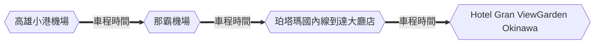
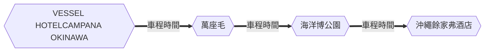
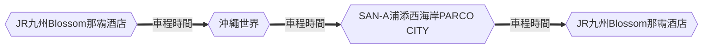

## 飛機

需於啟程時間前3小時到達機場

::: row
    ::: col
        <figure>
            
            <figcaption>高雄至沖繩</figcaption>
        </figure>
    ::: col
        <figure>
            
            <figcaption>沖繩至高雄</figcaption>
        </figure>

## 租車

[日本 Tabirai 租車比價網](https://tc.tabirai.net/car/okinawa/)

## 行程

=== "Day 1"

    ``` mermaid
    timeline
        Day 1 : 高雄小港機場 : 那霸機場 : 珀塔瑪國內線到達大廳店 : Hotel Gran View Garden Okinawa
    ```
=== "Day 2"

    ``` mermaid
    timeline
        Day 2 : Hotel Gran View Garden Okinawa : OTS臨空豐崎營業所 : 波上宮 : 港川外人住宅 : 沖繩兒童王國 : VESSEL HOTEL CAMPANA OKINAWA : 美國村 : VESSEL HOTEL CAMPANA OKINAWA
    ```
=== "Day 3"

    ``` mermaid
    timeline
        Day 3 : VESSEL HOTEL CAMPANA OKINAWA : 萬座毛 : 海洋博公園 : 沖繩餘家弗酒店
    ```
=== "Day 4"

    ``` mermaid
    timeline
        Day 4 : 沖繩餘家弗酒店 : 名護鳳梨園 : 古宇利大橋南端觀景台 : 古宇利蝦蝦飯 : 古宇利海洋塔 : JR九州Blossom那霸酒店
    ```
=== "Day 5"

    ``` mermaid
    timeline
        Day 5 : JR九州Blossom那霸酒店 : 沖繩世界 : SAN-A浦添西海岸 PARCO CITY : JR九州Blossom那霸酒店
    ```
=== "Day 6"

    ``` mermaid
    timeline
        Day 6 : JR九州Blossom那霸酒店 : 國際通 : 那霸機場 : 高雄小港機場
    ```

### Day 1



 | 地點                                                            | 抵達時間 | 停留時間 | 費用 | 備註 |
 | :-------------------------------------------------------------- | -------- | :------: | :--: | :--: |
 | [高雄小港機場](#高雄小港機場)                                   |          |          |      |      |
 | [那霸機場](#那霸機場)                                           |          |          |      |      |
 | :material-chevron-right-circle:[珀塔瑪國內線到達大廳店](#珀塔瑪國內線到達大廳店)               |          |          |      |      |
 | [Hotel Gran ViewGarden Okinawa](#hotel-gran-viewgarden-okinawa) |          |          |      |      |

#### 高雄小港機場

#### 那霸機場

#### 珀塔瑪國內線到達大廳店

#### Hotel Gran ViewGarden Okinawa

### Day 2


 | 地點                                                        | 抵達時間 | 停留時間 | 費用 | 備註 |
 | ----------------------------------------------------------- | -------- | -------- | ---- | ---- |
 | [OTS臨空豐崎營業所](#ots臨空豐崎營業所)                     |          |          |      |      |
 | [波上宮](#波上宮)                                           |          |          |      |      |
 | [港川外人住宅](#港川外人住宅)                               |          |          |      |      |
 | [沖繩兒童王國](#沖繩兒童王國)                               |          |          |      |      |
 | [VESSEL HOTELCAMPANA OKINAWA](#vessel-hotelcampana-okinawa) |          |          |      |      |
 | [美國村](#美國村)                                           |          |          |      |      |

#### OTS臨空豐崎營業所

#### 波上宮

#### 港川外人住宅

#### 沖繩兒童王國

#### VESSEL HOTELCAMPANA OKINAWA

#### 美國村

### Day 3



 | 地點                              | 抵達時間 | 停留時間 | 費用 | 備註 |
 | --------------------------------- | -------- | -------- | ---- | ---- |
 | [萬座毛](#萬座毛)                 |          |          |      |      |
 | [海洋博公園](#海洋博公園)         |          |          |      |      |
 | [沖繩餘家弗酒店](#沖繩餘家弗酒店) |          |          |  |      |

#### 萬座毛

#### 海洋博公園

#### 沖繩餘家弗酒店

### Day 4


 | 地點                                             | 抵達時間 | 停留時間 | 費用 | 備註 |
 | ------------------------------------------------ | -------- | -------- | ---- | ---- |
 | [名護鳳梨園](#名護鳳梨園)                        |          |          |      |      |
 | [古宇利大橋南端觀景台](#古宇利大橋南端觀景台)    |          |          |      |      |
 | [古宇利蝦蝦飯](#古宇利蝦蝦飯)                    |          |          |      |      |
 | [古宇利海洋塔](#古宇利海洋塔)                    |          |          |      |      |
 | [JR九州Blossom那霸酒店](#jr九州blossom那霸酒店) |          |          |      |      |

#### 名護鳳梨園

#### 古宇利大橋南端觀景台

#### 古宇利蝦蝦飯

#### 古宇利海洋塔

#### JR九州Blossom那霸酒店


### Day 5



 | 地點                                                    | 抵達時間 | 停留時間 | 費用 | 備註 |
 | ------------------------------------------------------- | -------- | -------- | ---- | ---- |
 | [沖繩世界](#沖繩世界)                                   |          |          |      |      |
 | [SAN-A浦添西海岸PARCO CITY](#san-a浦添西海岸parco-city) |          |          |      |      |

#### 沖繩世界

#### SAN-A浦添西海岸PARCO CITY

### Day 6


 | 地點                                                    | 抵達時間 | 停留時間 | 費用 | 備註 |
 | ------------------------------------------------------- | -------- | -------- | ---- | ---- |
 | [國際通](#國際通)                                   |          |          |      |      |

#### 國際通

## 參考資料

- [波比看世界](https://bobby.tw/2024-03-05-3072/)