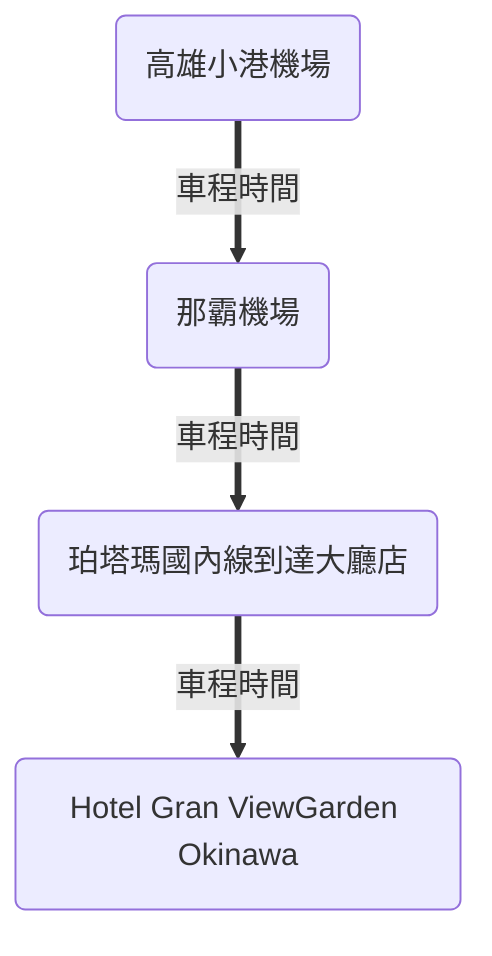
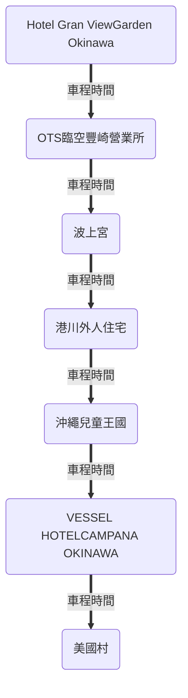
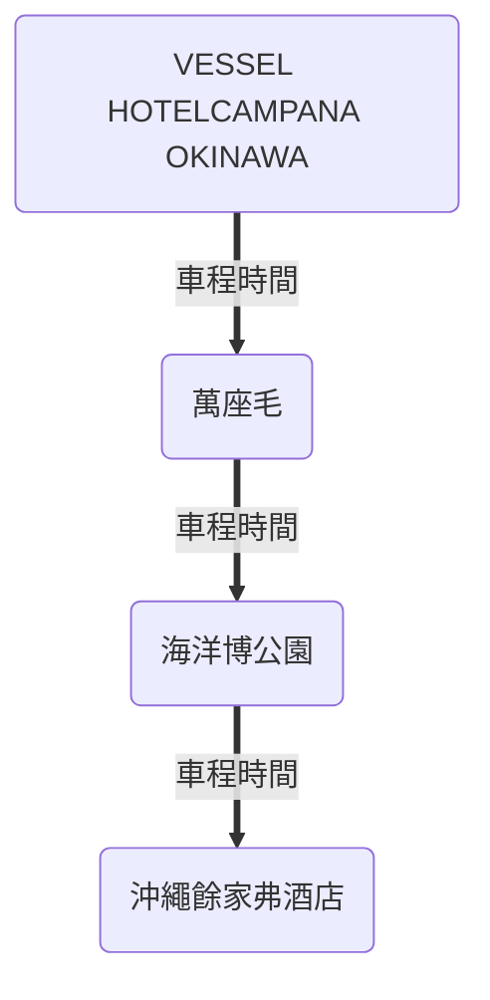
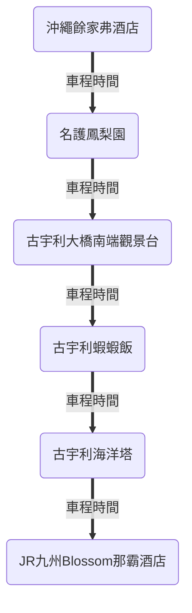
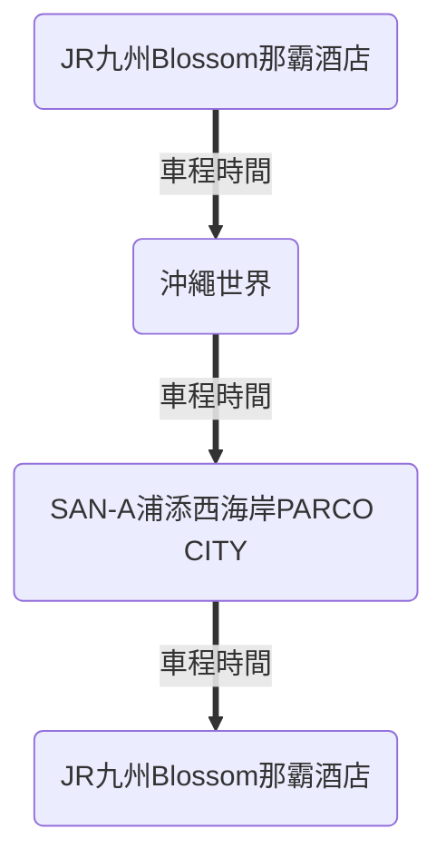
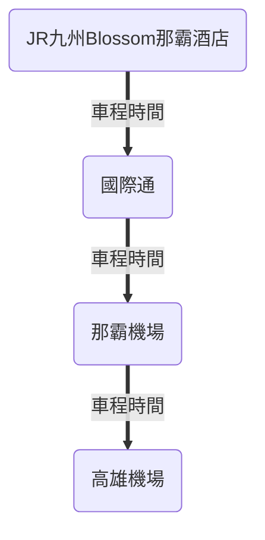

## 飛機

需於啟程時間前3小時到達機場

<figure markdown="span">
    
    <figcaption>高雄至沖繩</figcaption>
</figure>

<figure markdown="span">
    
    <figcaption>沖繩至高雄</figcaption>
</figure>

## 租車

[日本 Tabirai 租車比價網](https://tc.tabirai.net/car/okinawa/)

## 行程總表

=== "Day 1"

    ``` mermaid
    timeline
        Day 1 : 高雄小港機場 : 那霸機場 : 珀塔瑪國內線到達大廳店 : Hotel Gran View Garden Okinawa
    ```
=== "Day 2"

    ``` mermaid
    timeline
        Day 2 : Hotel Gran View Garden Okinawa : OTS臨空豐崎營業所 : 波上宮 : 港川外人住宅 : 沖繩兒童王國 : VESSEL HOTEL CAMPANA OKINAWA : 美國村 : VESSEL HOTEL CAMPANA OKINAWA
    ```
=== "Day 3"

    ``` mermaid
    timeline
        Day 3 : VESSEL HOTEL CAMPANA OKINAWA : 萬座毛 : 海洋博公園 : 沖繩餘家弗酒店
    ```
=== "Day 4"

    ``` mermaid
    timeline
        Day 4 : 沖繩餘家弗酒店 : 名護鳳梨園 : 古宇利大橋南端觀景台 : 古宇利蝦蝦飯 : 古宇利海洋塔 : JR九州Blossom那霸酒店
    ```
=== "Day 5"

    ``` mermaid
    timeline
        Day 5 : JR九州Blossom那霸酒店 : 沖繩世界 : SAN-A浦添西海岸 PARCO CITY : JR九州Blossom那霸酒店
    ```
=== "Day 6"

    ``` mermaid
    timeline
        Day 6 : JR九州Blossom那霸酒店 : 國際通 : 那霸機場 : 高雄小港機場
    ```

### Day 1



<table class="dcf-table dcf-table-responsive dcf-table-striped dcf-w-100%" markdown="span">
    <caption>行程列表</caption>
    <thead>
        <tr>
            <th scope="col">地點</th>
            <th scope="col">抵達時間</th>
            <th scope="col">停留時間</th>
            <th scope="col">費用</th>
            <th scope="col">備註</th>
        </tr>
    </thead>
    <tbody>
        <tr>
            <td data-label="地點">[高雄小港機場](#高雄小港機場)</td>
            <td data-label="抵達時間"></td>
            <td data-label="停留時間"></td>
            <td data-label="費用"></td>
            <td data-label="備註"></td>
        </tr>
        <tr>
            <td data-label="地點">[那霸機場](#那霸機場)</td>
            <td data-label="抵達時間"></td>
            <td data-label="停留時間"></td>
            <td data-label="費用"></td>
            <td data-label="備註"></td>
        </tr>
        <tr>
            <td data-label="地點">[珀塔瑪國內線到達大廳店](#珀塔瑪國內線到達大廳店)</td>
            <td data-label="抵達時間"></td>
            <td data-label="停留時間"></td>
            <td data-label="費用"></td>
            <td data-label="備註"></td>
        </tr>
        <tr>
            <td data-label="地點">[Hotel Gran ViewGarden Okinawa](#hotel-gran-viewgarden-okinawa)</td>
            <td data-label="抵達時間"></td>
            <td data-label="停留時間"></td>
            <td data-label="費用"></td>
            <td data-label="備註"></td>
        </tr>
    </tbody>
</table>

#### 高雄小港機場

#### 那霸機場

#### 珀塔瑪國內線到達大廳店

#### Hotel Gran ViewGarden Okinawa

### Day 2



<table class="dcf-table dcf-table-responsive dcf-table-striped dcf-w-100%" markdown="span">
    <caption>行程列表</caption>
    <thead>
        <tr>
            <th scope="col">地點</th>
            <th scope="col">抵達時間</th>
            <th scope="col">停留時間</th>
            <th scope="col">費用</th>
            <th scope="col">備註</th>
        </tr>
    </thead>
    <tbody>
        <tr>
            <td data-label="地點">[OTS臨空豐崎營業所](#ots臨空豐崎營業所)</td>
            <td data-label="抵達時間"></td>
            <td data-label="停留時間"></td>
            <td data-label="費用"></td>
            <td data-label="備註"></td>
        </tr>
        <tr>
            <td data-label="地點">[波上宮](#波上宮)</td>
            <td data-label="抵達時間"></td>
            <td data-label="停留時間"></td>
            <td data-label="費用"></td>
            <td data-label="備註"></td>
        </tr>
        <tr>
            <td data-label="地點">[港川外人住宅](#港川外人住宅)</td>
            <td data-label="抵達時間"></td>
            <td data-label="停留時間"></td>
            <td data-label="費用"></td>
            <td data-label="備註"></td>
        </tr>
        <tr>
            <td data-label="地點">[沖繩兒童王國](#沖繩兒童王國)</td>
            <td data-label="抵達時間"></td>
            <td data-label="停留時間"></td>
            <td data-label="費用"></td>
            <td data-label="備註"></td>
        </tr>
        <tr>
            <td data-label="地點">[VESSEL HOTELCAMPANA OKINAWA](#vessel-hotelcampana-okinawa)</td>
            <td data-label="抵達時間"></td>
            <td data-label="停留時間"></td>
            <td data-label="費用"></td>
            <td data-label="備註"></td>
        </tr>
        <tr>
            <td data-label="地點">[美國村](#美國村)</td>
            <td data-label="抵達時間"></td>
            <td data-label="停留時間"></td>
            <td data-label="費用"></td>
            <td data-label="備註"></td>
        </tr>
    </tbody>
</table>

#### OTS臨空豐崎營業所

#### 波上宮

#### 港川外人住宅

#### 沖繩兒童王國

#### VESSEL HOTELCAMPANA OKINAWA

#### 美國村

### Day 3



<table class="dcf-table dcf-table-responsive dcf-table-striped dcf-w-100%" markdown="span">
    <caption>行程列表</caption>
    <thead>
        <tr>
            <th scope="col">地點</th>
            <th scope="col">抵達時間</th>
            <th scope="col">停留時間</th>
            <th scope="col">費用</th>
            <th scope="col">備註</th>
        </tr>
    </thead>
    <tbody>
        <tr>
            <td data-label="地點">[萬座毛](#萬座毛)</td>
            <td data-label="抵達時間"></td>
            <td data-label="停留時間"></td>
            <td data-label="費用"></td>
            <td data-label="備註"></td>
        </tr>
        <tr>
            <td data-label="地點">[海洋博公園](#海洋博公園)</td>
            <td data-label="抵達時間"></td>
            <td data-label="停留時間"></td>
            <td data-label="費用"></td>
            <td data-label="備註"></td>
        </tr>
        <tr>
            <td data-label="地點">[沖繩餘家弗酒店](#沖繩餘家弗酒店)</td>
            <td data-label="抵達時間"></td>
            <td data-label="停留時間"></td>
            <td data-label="費用"></td>
            <td data-label="備註"></td>
        </tr>
    </tbody>
</table>

#### 萬座毛

#### 海洋博公園

#### 沖繩餘家弗酒店

### Day 4



<table class="dcf-table dcf-table-responsive dcf-table-striped dcf-w-100%" markdown="span">
    <caption>行程列表</caption>
    <thead>
        <tr>
            <th scope="col">地點</th>
            <th scope="col">抵達時間</th>
            <th scope="col">停留時間</th>
            <th scope="col">費用</th>
            <th scope="col">備註</th>
        </tr>
    </thead>
    <tbody>
        <tr>
            <td data-label="地點">[名護鳳梨園](#名護鳳梨園)</td>
            <td data-label="抵達時間"></td>
            <td data-label="停留時間"></td>
            <td data-label="費用"></td>
            <td data-label="備註"></td>
        </tr>
        <tr>
            <td data-label="地點">[古宇利大橋南端觀景台](#古宇利大橋南端觀景台)</td>
            <td data-label="抵達時間"></td>
            <td data-label="停留時間"></td>
            <td data-label="費用"></td>
            <td data-label="備註"></td>
        </tr>
        <tr>
            <td data-label="地點">[古宇利蝦蝦飯](#古宇利蝦蝦飯)</td>
            <td data-label="抵達時間"></td>
            <td data-label="停留時間"></td>
            <td data-label="費用"></td>
            <td data-label="備註"></td>
        </tr>
        <tr>
            <td data-label="地點">[古宇利海洋塔](#古宇利海洋塔)</td>
            <td data-label="抵達時間"></td>
            <td data-label="停留時間"></td>
            <td data-label="費用"></td>
            <td data-label="備註"></td>
        </tr>
        <tr>
            <td data-label="地點">[JR九州Blossom那霸酒店](#jr九州blossom那霸酒店)</td>
            <td data-label="抵達時間"></td>
            <td data-label="停留時間"></td>
            <td data-label="費用"></td>
            <td data-label="備註"></td>
        </tr>
    </tbody>
</table>

#### 名護鳳梨園

#### 古宇利大橋南端觀景台

#### 古宇利蝦蝦飯

#### 古宇利海洋塔

#### JR九州Blossom那霸酒店


### Day 5



<table class="dcf-table dcf-table-responsive dcf-table-striped dcf-w-100%" markdown="span">
    <caption>行程列表</caption>
    <thead>
        <tr>
            <th scope="col">地點</th>
            <th scope="col">抵達時間</th>
            <th scope="col">停留時間</th>
            <th scope="col">費用</th>
            <th scope="col">備註</th>
        </tr>
    </thead>
    <tbody>
        <tr>
            <td data-label="地點">[沖繩世界](#沖繩世界)</td>
            <td data-label="抵達時間"></td>
            <td data-label="停留時間"></td>
            <td data-label="費用"></td>
            <td data-label="備註"></td>
        </tr>
        <tr>
            <td data-label="地點">[SAN-A浦添西海岸PARCO CITY](#san-a浦添西海岸parco-city)</td>
            <td data-label="抵達時間"></td>
            <td data-label="停留時間"></td>
            <td data-label="費用"></td>
            <td data-label="備註"></td>
        </tr>
    </tbody>
</table>

#### 沖繩世界

#### SAN-A浦添西海岸PARCO CITY

### Day 6



<table class="dcf-table dcf-table-responsive dcf-table-striped dcf-w-100%" markdown="span">
    <caption>行程列表</caption>
    <thead>
        <tr>
            <th scope="col">地點</th>
            <th scope="col">抵達時間</th>
            <th scope="col">停留時間</th>
            <th scope="col">費用</th>
            <th scope="col">備註</th>
        </tr>
    </thead>
    <tbody>
        <tr>
            <td data-label="地點">[國際通](#國際通)</td>
            <td data-label="抵達時間"></td>
            <td data-label="停留時間"></td>
            <td data-label="費用"></td>
            <td data-label="備註"></td>
        </tr>
    </tbody>
</table>

#### 國際通

## 參考資料

- [波比看世界](https://bobby.tw/2024-03-05-3072/)
- [table](https://ianrmedia.unl.edu/responsive-table-generator-tool)

Incididunt esse ex velit aute sunt est culpa.Incididunt esse ex velit aute sunt est culpa.Incididunt esse ex velit aute sunt est culpa.Incididunt esse ex velit aute sunt est culpa.Incididunt esse ex velit aute sunt est culpa.