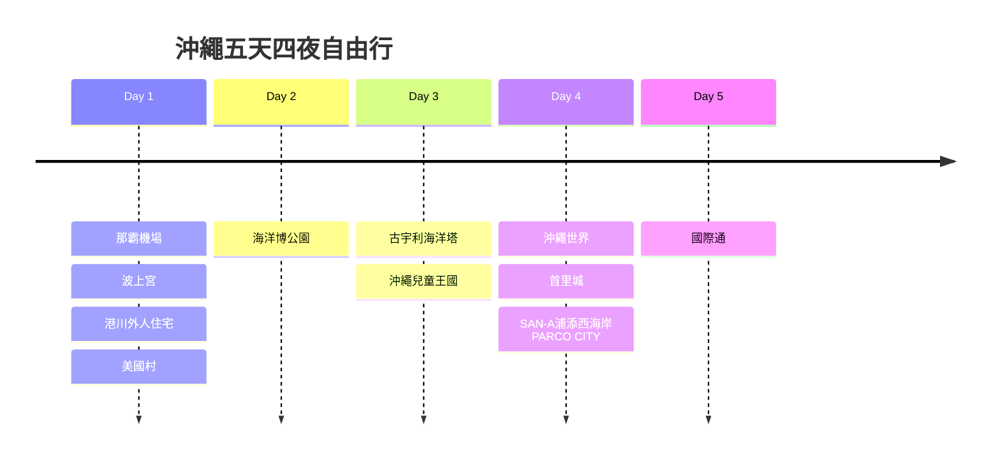
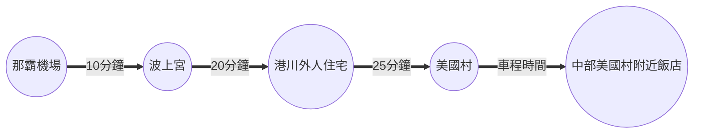
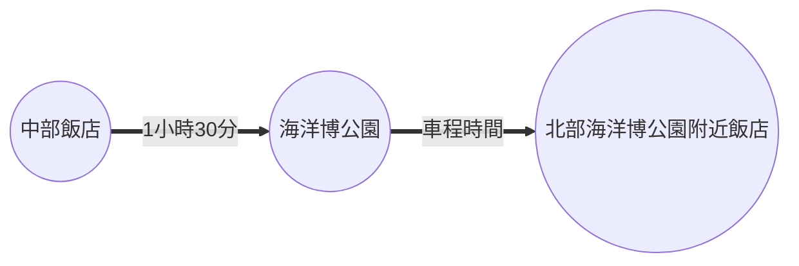
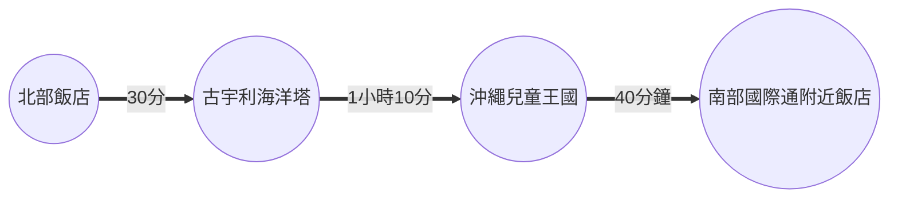
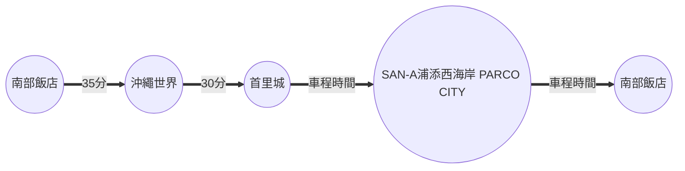
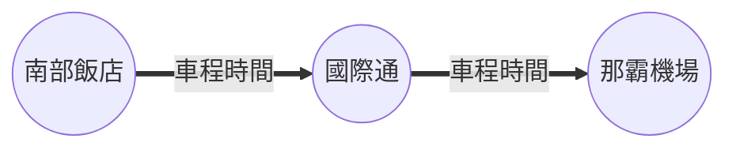

## 飛機

- 去程：虎航0945-1230
- 回程：華航2000-2055

## 行程

### Day 1

 | 地點         | 預估停留時間 | 備註 |
 | ------------ | ------------ | ---- |
 | 那霸機場     |              |      |
 | 波上宮       |              |      |
 | 港川外人住宅 |              |      |
 | 美國村       | 3小時        |      |
 | 飯店         |              |      |

### Day 2

 | 地點       | 預估停留時間 | 備註 |
 | ---------- | ------------ | ---- |
 | 海洋博公園 |              |      |
 | 北部飯店   |              |      |

### Day 3

 | 地點         | 預估停留時間 | 備註 |
 | ------------ | ------------ | ---- |
 | 古宇利海洋塔 |              |      |
 | 沖繩兒童王國 |              |      |
 | 南部飯店     |              |      |

### Day 4

 | 地點                       | 預估停留時間 | 備註 |
 | -------------------------- | ------------ | ---- |
 | 沖繩世界                   |              |      |
 | 首里城                     |              |      |
 | SAN-A浦添西海岸 PARCO CITY |              |      |

### Day 5

 | 地點   | 預估停留時間 | 備註 |
 | ------ | ------------ | ---- |
 | 國際通 |              |      |

## 景點預估停留時間

### 北部

| 項次 | 景點           | 預估停留時間 | 備註                           |
| ---- | -------------- | ------------ | ------------------------------ |
| 1    | 海洋博公園     |              |                                |
|      | - 美麗海水族館 | 3小時        | 15:00及17:00各有一場鯨鯊餵食秀 |
|      |                |              |                                |

## 租車

[日本 Tabirai 租車比價網](https://tc.tabirai.net/car/okinawa/)

Tempor non ex consectetur anim velit est occaecat labore aliquip.Tempor non ex consectetur anim velit est occaecat labore aliquip.Tempor non ex consectetur anim velit est occaecat labore aliquip.Tempor non ex consectetur anim velit est occaecat labore aliquip