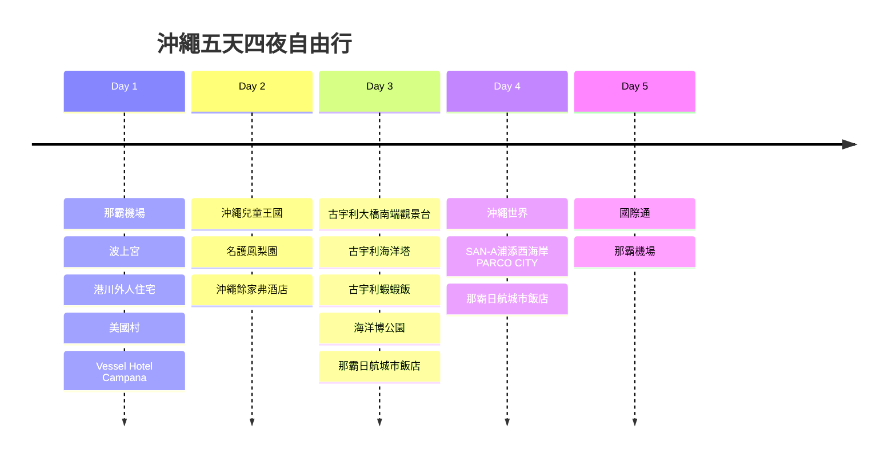
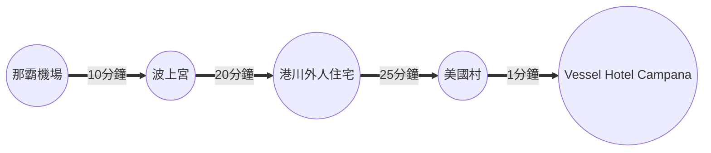
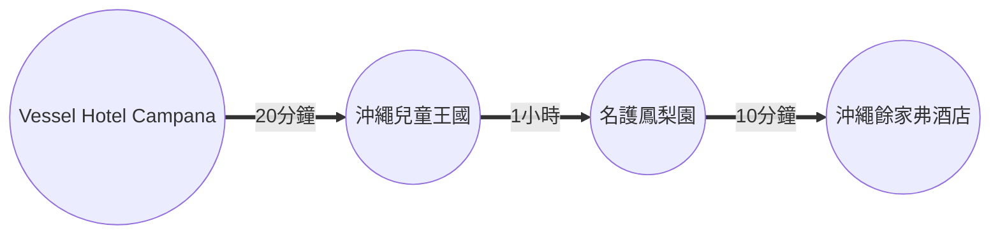
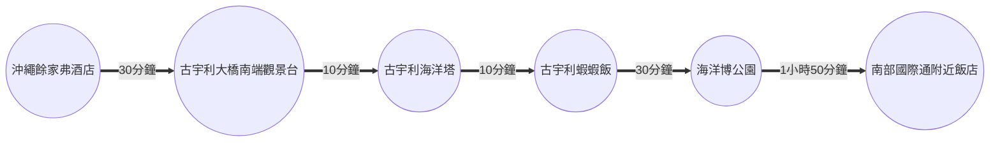
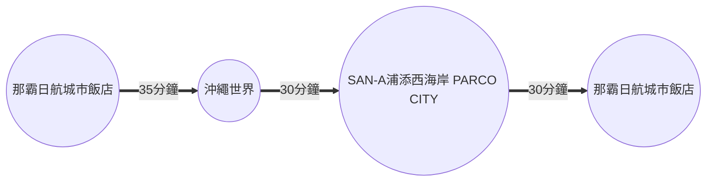
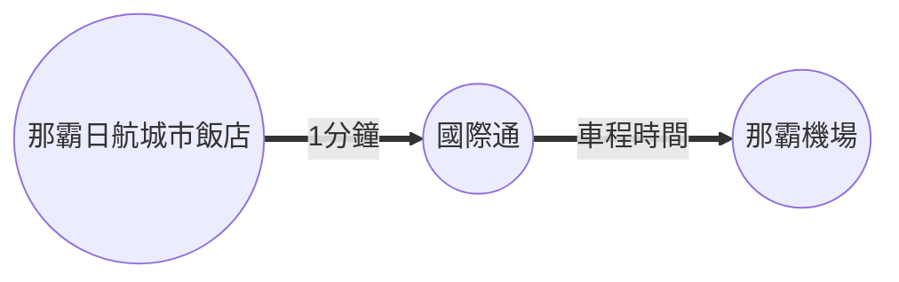

## 飛機

需於啟程時間前3小時到達機場

- 去程：虎航0945-1230
- 回程：華航2000-2055

## 租車

[日本 Tabirai 租車比價網](https://tc.tabirai.net/car/okinawa/)

## 行程

### Day 1

 | 地點                                                              | 抵達時間 | 停留時間 |      費用      |     備註     |
 | :---------------------------------------------------------------- | -------- | :------: | :------------: | :----------: |
 | [那霸機場](https://maps.app.goo.gl/GQ1ZGzHTqF1LeNj77)             | 12:30    |  1小時   |                |              |
 | [波上宮](#波上宮)                                                 | 14:00    |  1小時   |                |              |
 | [港川外人住宅](#港川外人住宅)         | 15:30    |  1小時   |                |              |
 | [美國村](https://maps.app.goo.gl/zWJyasgLXc2qhLKU8)               | 17:00    |          |                |              |
 | [Vessel Hotel Campana](https://maps.app.goo.gl/RYRJQNYJm6sff43p9) | 17:00    |   N/A    | 2600，不含早餐 | 最靠近美國村 |

#### 波上宮

地址：沖繩縣那覇市若狭1-25-11([Google地圖](https://maps.app.goo.gl/ECtPmBpXF3wF51H98))

Map Code：33 185 022*00

::: row
    ::: col
        
    ::: col
        
::: row
    ::: col
        
    ::: col
        

懸崖上的絕美神社－波上宮，為沖繩八社之首、有沖繩總鎮守之稱，為沖繩最具代表性的神社。要拍攝波上宮佇立在懸崖上的 ==最佳拍攝地點是波之上臨海道路== ；神社內販賣的 ==超可愛保佑交通安全的書包御守== 也是重點。

#### 港川外人住宅

地址：沖繩縣浦添市港川 2丁目([Google地圖](https://maps.app.goo.gl/ECtPmBpXF3wF51H98))

Map Code：33 340 059*58

::: row
    ::: col
        

##### 停車

- 住宅區內停車場：浦添市港川 2丁目 – 17 – 3 
- Yamada電機對面停車場：浦添市港川 2丁目 – 24

##### oHacorte水果塔

位置：FLORIDA st. No.18

營業時間：11:30–19:00 (周二公休)

::: row
    ::: col
        
    ::: col
        
酸甜水果，融合香甜滑順卡士達醬，配上外頭香脆塔皮超級好吃～每口都能吃到不同水果，令人期待下一口會有什麼驚喜，層次豐富、甜而不膩的美味甜點。

##### ほうき星

位置：NEVADA st. No.25

營業時間：11:30–18:00 (周一至周日)

::: row
    ::: col
        
    ::: col
        
2018年4月開幕的可麗露專賣店，「ほうき星」是港川外人住宅近期竄起甜點新星，以黑糖、牛奶、雞蛋等，沖繩當地食材製作，沒有多餘食品添加物令人安心。

##### PORTRIVER MARKET

位置：NEVADA st. No.30

營業時間：12:00–18:00 (周三、日公休)

::: row
    :::col
        
    :::col
        
販賣各式生活用品的Portriver Market，秉持將沖繩好物推薦給更多人的精神，所有商品都由老闆夫妻親自挑選，包括玻璃瓷器、服飾飾品、手提包等諸多沖繩風格滿點的個性小物

##### 鶏そば屋いしぐふー

位置：KANSAS st. No.40

營業時間：10:00–15:00 (周六日延長至16:00，周一二公休)

::: row
    ::: col
        
    ::: col
鶏そば屋いしぐふー是全沖繩唯一以「山原地雞」熬製湯頭的沖繩麵，雞湯清甜不油膩、雞肉厚實又嫩口，配上Q彈麵條超完美；還能以日幣100元自己涮多種縣產野菜，美味又兼顧營養均衡，是港川外人住宅午餐好選擇。

### Day 2

 | 地點                                                        | 抵達時間 | 停留時間 | 費用           | 備註                  |
 | ----------------------------------------------------------- | -------- | -------- | -------------- | --------------------- |
 | [沖繩兒童王國](https://maps.app.goo.gl/FjZwNmp4SPbwNXmu9)   | 09:30    | 3小時    | 198/人         | 營業時間：09:30~17:00 |
 | [名護鳳梨園](https://maps.app.goo.gl/t3SHjvH5qxjcCz9x9)     | 13:30    | 3小時    | 264/人         | 262/人                |
 | [沖繩餘家弗酒店](https://maps.app.goo.gl/y5W4MxdgoHXwc6u89) | 17:00    |          | 2500，不含早餐 |                       |

### Day 3

 | 地點                                                                                      | 抵達時間 | 停留時間    | 費用   | 備註                                                      |
 | ----------------------------------------------------------------------------------------- | -------- | ----------- | ------ | --------------------------------------------------------- |
 | [古宇利大橋南端觀景台](https://maps.app.goo.gl/GEmXYP58JAcMwWom6)                         | 10:00    | 30分鐘      |        |                                                           |
 | [古宇利海洋塔](https://maps.app.goo.gl/i4wg6W1Dafe3v4NY7)                                 | 10:40    | 1小時       | 218/人 |                                                           |
 | [古宇利蝦蝦飯](https://maps.app.goo.gl/NdQ2wRRGBg7mQxqEA)                                 | 12:00    | 1小時       |        | 營業時間：11:00~18:00                                     |
 | [海洋博公園](https://maps.app.goo.gl/j79NjZDm5XtfDq827)                                   | 13:30    |             |        |                                                           |
 | :material-chevron-right-circle: [美麗海水族館](https://maps.app.goo.gl/gcrSFoseD7Ah5U7t6) | 13:40    | 2小時30分鐘 | 476/人 | 15:00及17:00各有一場鯨鯊餵食秀                            |
 | :material-chevron-right-circle: [海豚潟湖](https://maps.app.goo.gl/4Nut7ZBfCJEu6atX9)     | 17:00    | 30分鐘      | N/A    | 10:30、11:30、13:00、15:00、17:00各一場海豚表演，約20分鐘 |
 | [那霸日航城市飯店](https://maps.app.goo.gl/cHnqvEFxk51cmTmw8)                             | 20:00    |             | 2762   |                                                           |

### Day 4

 | 地點                                                                    | 抵達時間 | 停留時間 | 費用   | 備註                  |
 | ----------------------------------------------------------------------- | -------- | -------- | ------ | --------------------- |
 | [沖繩世界](https://maps.app.goo.gl/EZWNiJsGyqvsStmz7)                   | 10:00    | 3小時    | 415/人 | 營業時間：09:00~17:30 |
 | [SAN-A浦添西海岸 PARCO CITY](https://maps.app.goo.gl/S23eBtPSiVVVgeAbA) | 13:30    | 4小時    |        |                       |

### Day 5

 | 地點                                                  | 抵達時間 | 停留時間 | 費用 | 備註 |
 | ----------------------------------------------------- | -------- | -------- | ---- | ---- |
 | [國際通](https://maps.app.goo.gl/qF4pHa9WqSJvBWfw9)   |          |          |      |      |
 | [那霸機場](https://maps.app.goo.gl/GQ1ZGzHTqF1LeNj77) |          |          |      |      |

## 參考資料

- [波比看世界](https://bobby.tw/2024-03-05-3072/)