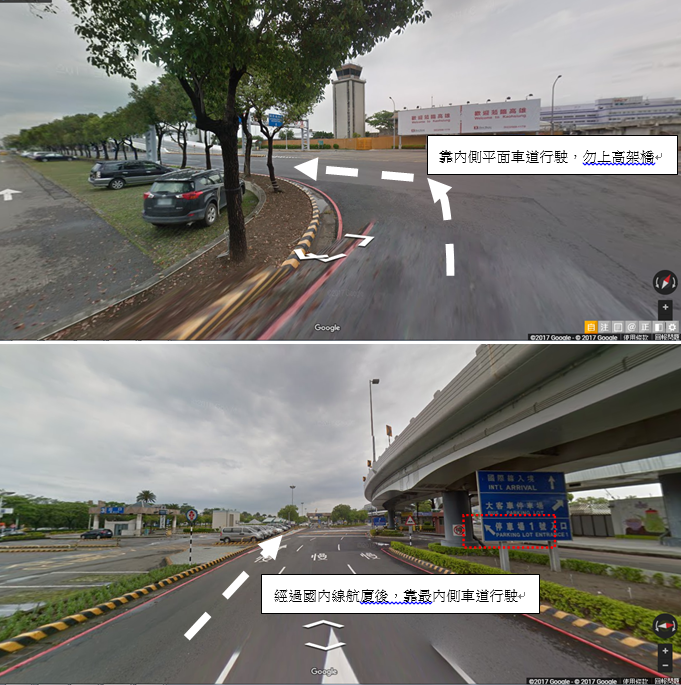
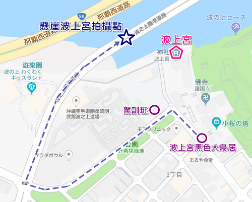

目錄
{.toctitle}

- [行程](#行程)
	- [Day 1](#day-1)
		- [高雄小港機場](#高雄小港機場)
		- [高雄小港機場停車場](#高雄小港機場停車場)
		- [珀塔瑪國內線到達大廳店](#珀塔瑪國內線到達大廳店)
		- [那霸機場](#那霸機場)
		- [Hotel Gran ViewGarden Okinawa](#hotel-gran-viewgarden-okinawa)
	- [Day 2](#day-2)
		- [OTS臨空豐崎營業所](#ots臨空豐崎營業所)
		- [波上宮](#波上宮)
		- [港川外人住宅](#港川外人住宅)
		- [沖繩兒童王國](#沖繩兒童王國)
		- [VESSEL HOTELCAMPANA OKINAWA](#vessel-hotelcampana-okinawa)
		- [美國村](#美國村)
	- [Day 3](#day-3)
		- [萬座毛](#萬座毛)
		- [海洋博公園](#海洋博公園)
		- [沖繩餘家弗酒店](#沖繩餘家弗酒店)
	- [Day 4](#day-4)
		- [名護鳳梨園](#名護鳳梨園)
		- [古宇利大橋南端觀景台](#古宇利大橋南端觀景台)
		- [古宇利蝦蝦飯](#古宇利蝦蝦飯)
		- [古宇利海洋塔](#古宇利海洋塔)
		- [JR九州Blossom那霸酒店](#jr九州blossom那霸酒店)
	- [Day 5](#day-5)
		- [沖繩世界](#沖繩世界)
		- [SAN-A浦添西海岸PARCO CITY](#san-a浦添西海岸parco-city)
		- [首里城（非必要）](#首里城非必要)
	- [Day 6](#day-6)
		- [國際通](#國際通)
- [出發前準備](#出發前準備)
	- [機票](#機票)
	- [租車](#租車)
- [參考資料](#參考資料)

## 行程

### Day 1

交通時間
{: .tabletitle}

行程列表
{: .tabletitle}

| 時間        | 行程                                                                                    |
| ----------- | --------------------------------------------------------------------------------------- |
| 12:30-15:30 | 從家中開車前往[高雄小港機場停車場](#高雄小港機場停車場)，之後至[高雄小港機場](#高雄小港機場)搭乘15:30班機 |
| 18:30-21:00 | 18:30到達[那霸機場](#那霸機場)，然後前往[珀塔瑪國內線到達大廳店](#珀塔瑪國內線到達大廳店)購買晚餐後搭乘計程車前往飯店 |
| 21:30       | 到達[Hotel Gran ViewGarden Okinawa](#hotel-gran-viewgarden-okinawa)辦理入住             |

#### 高雄小港機場

??? info "基本資訊"
    - 地址：[高雄市小港區中山四路2號](https://maps.app.goo.gl/vC8fCnfcoqRqWpFm6)

#### 高雄小港機場停車場

汽車可以直接停放小港機場附設的停車場，當日最高240元，每天00:00重新計算，
可以使用[歐特儀-航空站停車預約平台](https://airport.altob.com.tw/)預約及查詢車位，到達方式參考下圖

<figure markdown="span">
    
    <figcaption>停車場配置圖（[來源：高雄國際航空站](https://www.kia.gov.tw/Transportation/Airporttraffic/Parking.htm)）</figcaption>
</figure>

<figure markdown="span">
    
    
    
    
    <figcaption>汽車停車場路線指引（來源：[高雄國際航空站](https://www.kia.gov.tw/Transportation/Airporttraffic/Parking.htm)）</figcaption>
</figure>

#### 珀塔瑪國內線到達大廳店

???info "基本資訊"
    - 營業時間：7:00 - 21:00
    - 地址： 沖繩縣那霸市鏡水150 那霸機場國內線航廈1F
    - MAP Code： 331 232 79*00

所有飯糰均包含白米、雞蛋、午餐肉及海苔，珀塔瑪口味即為原味，其中**炸蝦塔塔醬**口味為最多人選擇

地圖
{.contentheader}

<figure markdown="span">
    
    <figcaption>珀塔瑪國內線到達大廳店位置（[來源：那霸空港](https://www.naha-airport.co.jp/zh-hant/access/taxi/)）</figcaption>
</figure>

菜單
{.contentheader}

<figure markdown="span">
	
	
	
    <figcaption>菜單（[來源：pork tamago onigiri](http://porktamago.com/zh-TW/shop/)）</figcaption>
</figure>

#### 那霸機場

地圖
{.contentheader}

<figure markdown="span">
    
    <figcaption>計程車搭乘位置（[來源：那霸空港](https://www.naha-airport.co.jp/zh-hant/access/taxi/)）</figcaption>
</figure>

#### Hotel Gran ViewGarden Okinawa

???info "基本資訊"
    - 入住時間：15:00 - 00:00
    - 地址： [沖繩縣豐見城市豐崎3-82](https://maps.app.goo.gl/Wo3V7oudsGcVJPaJ9)
    - MAP Code： 232 543 706*60

房型價格
{.contentheader}

<figure markdown="span">
    
    <figcaption>飯店房型價格（[來源：OTS HOTEL](https://www.otsinternational.jp/hotel/cnh/okinawa/tomishiro/47GVG/)）</figcaption>
</figure>

### Day 2

交通時間
{: .tabletitle}

行程列表
{: .tabletitle}

| 時間      | 行程                                                    |
| --------- | ------------------------------------------------------- |
| 0800-0900 | 由飯店步行至[OTS臨空豐崎營業所](#ots臨空豐崎營業所)租車 |
| 0900-1000 | 至[波上宮](#波上宮)參拜後前往波之上臨港道路拍照         |
| 1030-1200 | 到達[港川外人住宅](#港川外人住宅) |

#### OTS臨空豐崎營業所

???info "基本資訊"
    - 入住時間：15:00 - 00:00
    - 地址： [沖繩縣豐見城市豐崎3-37](https://maps.app.goo.gl/TPvWkrV3v7GBFaqJ9)
    - MAP Code： 232 543 532*73

#### 波上宮

???info "基本資訊"
    - 入住時間：09:00 - 17:00
    - 地址： [沖繩縣那覇市若狭1-25-11](https://maps.app.goo.gl/9pbfCevsqtKLsvfU7)
    - MAP Code： 33 185 022*71

波上宮在琉球八社中排名第一，並以「當國第一的神社」而受到尊崇。明治時期被列為官幣小社，是守護沖繩最偉大的神殿，但卻在大戰時被燒毀了。
戰後，昭和二十八年重建正殿與社務所，三十六年重建前殿。平成五年，平成的御造營將正殿以外部分竣工。平成十八年，被指定為那霸市史蹟文化遺產。

內有販賣各式御守，以以下三種較為特殊，第一種為琉球紅型染布的健康護身符、第二種為日式小學生書包造型的交通安全護身符、第三種為貝殼造型的姻緣護身符。

<figure markdown="span">
	
    <figcaption>御守（[來源：波上宮](https://www.otsinternational.jp/hotel/cnh/okinawa/tomishiro/47GVG/)）</figcaption>
</figure>

波上宮最佳拍照地點
{.contentheader}
<figure markdown="span">
	
	
    <figcaption>波上宮最佳拍照地點（[來源：波比看世界](https://bobby.tw/2024-01-07-2698/)）</figcaption>
</figure>

停車
{.contentheader}

波上宮本身有提供停車位，但限停30分鐘，若怕太趕可以至以下停車場

- [波之上立體停車場](https://maps.app.goo.gl/JhGi7Gw4HK3yFVaZA)
    - 地址：3 Chome-1 Tsuji, Naha, Okinawa 900-0037日本
    - MAP Ｃode：33 155 705*13
    - 收費：20分鐘100円

#### 港川外人住宅

#### 沖繩兒童王國

#### VESSEL HOTELCAMPANA OKINAWA

#### 美國村

### Day 3

#### 萬座毛

#### 海洋博公園

#### 沖繩餘家弗酒店

### Day 4

#### 名護鳳梨園

#### 古宇利大橋南端觀景台

#### 古宇利蝦蝦飯

#### 古宇利海洋塔

#### JR九州Blossom那霸酒店

### Day 5

#### 沖繩世界

#### SAN-A浦添西海岸PARCO CITY

#### 首里城（非必要）

### Day 6

#### 國際通

## 出發前準備

### 機票

需於啟程時間前3小時到達機場

<figure markdown="span">
    
    <figcaption>高雄至沖繩</figcaption>
</figure>

<figure markdown="span">
    
    <figcaption>沖繩至高雄</figcaption>
</figure>

### 租車

[日本 Tabirai 租車比價網](https://tc.tabirai.net/car/okinawa/)

## 參考資料

- [波比看世界](https://bobby.tw/2024-03-05-3072/)
- [table](https://ianrmedia.unl.edu/responsive-table-generator-tool)

