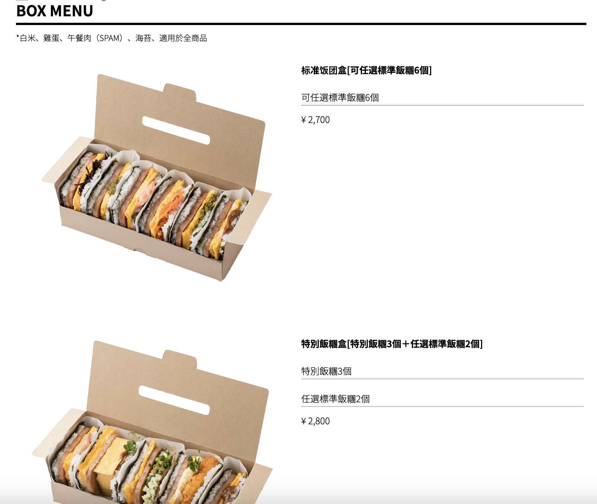
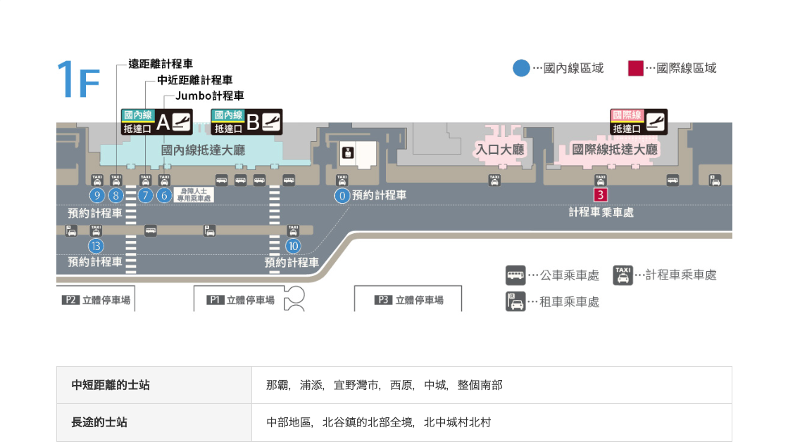

## 行程

### Day 1

交通時間
{: .title}

行程列表
{: .title}

| 時間        | 行程                                                                                    |
| ----------- | --------------------------------------------------------------------------------------- |
| 12:30-15:30 | 從家中開車前往[高雄小港機場停車場](#高雄小港機場停車場)，之後至[高雄小港機場](#高雄小港機場)搭乘15:30班機 |
| 18:30-21:00 | 18:30到達[那霸機場](#那霸機場)，然後前往[珀塔瑪國內線到達大廳店](#珀塔瑪國內線到達大廳店)購買晚餐後搭乘計程車前往飯店 |
| 21:30       | 到達[Hotel Gran ViewGarden Okinawa](#hotel-gran-viewgarden-okinawa)辦理入住             |

#### 高雄小港機場

!!! info "基本資訊"
    - 地址：[高雄市小港區中山四路2號](https://maps.app.goo.gl/vC8fCnfcoqRqWpFm6)

#### 高雄小港機場停車場

汽車可以直接停放小港機場附設的停車場，當日最高240元，每天00:00重新計算，
可以使用[歐特儀-航空站停車預約平台](https://airport.altob.com.tw/)預約及查詢車位，到達方式參考下圖

<figure markdown="span">
    
    <figcaption>停車場配置圖（[來源：高雄國際航空站](https://www.kia.gov.tw/Transportation/Airporttraffic/Parking.htm)）</figcaption>
</figure>

<figure markdown="span">
    
    
    
    
    <figcaption>汽車停車場路線指引（來源：[高雄國際航空站](https://www.kia.gov.tw/Transportation/Airporttraffic/Parking.htm)）</figcaption>
</figure>

#### 珀塔瑪國內線到達大廳店

!!!info "基本資訊"
    - 營業時間：7:00 - 21:00
    - 地址： 沖繩縣那霸市鏡水150 那霸機場國內線航廈1F
    - MAP Code： 331 232 79*00

地圖
{.contentheader}

<figure markdown="span">
    
    <figcaption>珀塔瑪國內線到達大廳店位置（[來源：那霸空港](https://www.naha-airport.co.jp/zh-hant/access/taxi/)）</figcaption>
</figure>

菜單
{.contentheader}

#### 那霸機場

地圖
{.contentheader}

<figure markdown="span">
    
    <figcaption>計程車搭乘位置（[來源：那霸空港](https://www.naha-airport.co.jp/zh-hant/access/taxi/)）</figcaption>
</figure>

#### Hotel Gran ViewGarden Okinawa

!!!info "基本資訊"
    - 入住時間：15:00 - 00:00
    - 地址： [沖繩縣豐見城市豐崎3-82](https://maps.app.goo.gl/Wo3V7oudsGcVJPaJ9)
    - MAP Code： 232 543 706*60

房型價格
{.contentheader}

<figure markdown="span">
    
    <figcaption>飯店房型價格（[來源：OTS HOTEL](https://www.otsinternational.jp/hotel/cnh/okinawa/tomishiro/47GVG/)）</figcaption>
</figure>

### Day 2

交通時間
{: .title}

行程列表
{: .title}

| 時間      | 行程                                                    |
| --------- | ------------------------------------------------------- |
| 0800-0900 | 由飯店步行至[OTS臨空豐崎營業所](#ots臨空豐崎營業所)租車 |
| 0900-1000 | 至[波上宮](#波上宮)參拜後前往一旁沙灘拍照               |

#### OTS臨空豐崎營業所

#### 波上宮

#### 港川外人住宅

#### 沖繩兒童王國

#### VESSEL HOTELCAMPANA OKINAWA

#### 美國村

### Day 3

#### 萬座毛

#### 海洋博公園

#### 沖繩餘家弗酒店

### Day 4

#### 名護鳳梨園

#### 古宇利大橋南端觀景台

#### 古宇利蝦蝦飯

#### 古宇利海洋塔

#### JR九州Blossom那霸酒店

### Day 5

#### 沖繩世界

#### SAN-A浦添西海岸PARCO CITY

#### 首里城

### Day 6

#### 國際通

## 出發前準備

### 機票

需於啟程時間前3小時到達機場

<figure markdown="span">
    
    <figcaption>高雄至沖繩</figcaption>
</figure>

<figure markdown="span">
    
    <figcaption>沖繩至高雄</figcaption>
</figure>

### 租車

[日本 Tabirai 租車比價網](https://tc.tabirai.net/car/okinawa/)

## 參考資料

- [波比看世界](https://bobby.tw/2024-03-05-3072/)
- [table](https://ianrmedia.unl.edu/responsive-table-generator-tool)

