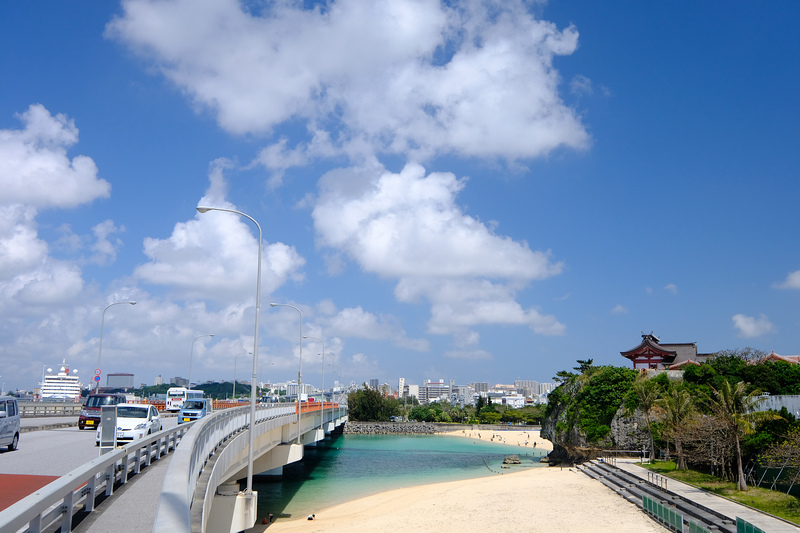
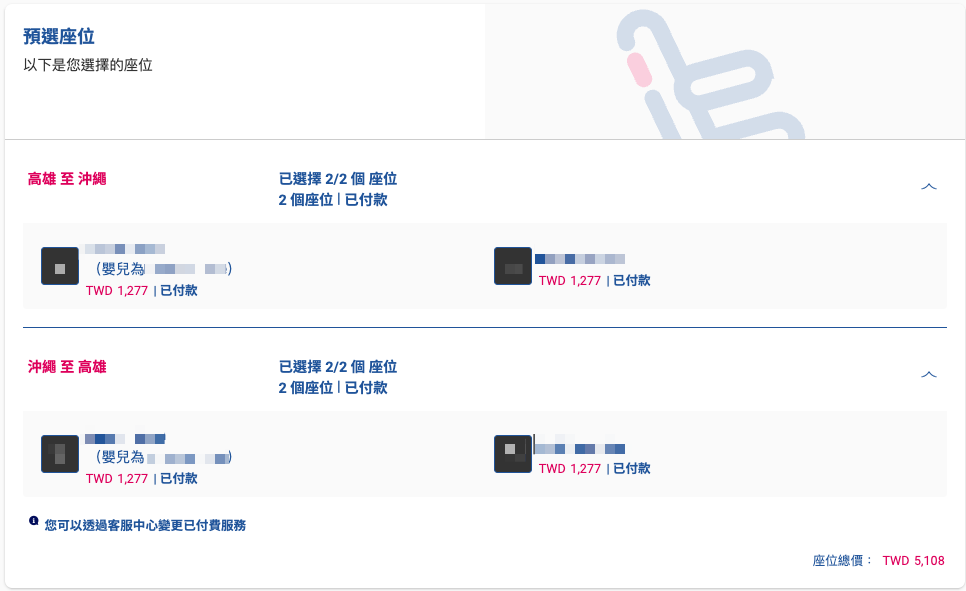

目錄
{.toctitle}

- [1. 行程](#1-行程)
  - [1.1. Day 1 - 12/11（三）](#11-day-1---1211三)
    - [1.1.1. 高雄小港機場](#111-高雄小港機場)
      - [1.1.1.1.  基本資訊](#1111--基本資訊)
      - [1.1.1.2. 停車](#1112-停車)
    - [1.1.2. 珀塔瑪國內線到達大廳店](#112-珀塔瑪國內線到達大廳店)
      - [1.1.2.1. 基本資訊](#1121-基本資訊)
      - [1.1.2.2. 地圖](#1122-地圖)
      - [1.1.2.3. 菜單](#1123-菜單)
    - [1.1.3. 那霸機場](#113-那霸機場)
      - [1.1.3.1. 地圖](#1131-地圖)
    - [1.1.4. Hotel Gran ViewGarden Okinawa](#114-hotel-gran-viewgarden-okinawa)
      - [1.1.4.1. 基本資訊](#1141-基本資訊)
      - [1.1.4.2. 房型價格](#1142-房型價格)
  - [1.2. Day 2 - 12/12（四）](#12-day-2---1212四)
    - [1.2.1. OTS臨空豐崎營業所](#121-ots臨空豐崎營業所)
      - [1.2.1.1. 基本資訊](#1211-基本資訊)
    - [1.2.2. 波上宮](#122-波上宮)
      - [1.2.2.1. 基本資訊](#1221-基本資訊)
      - [1.2.2.2. 基本介紹](#1222-基本介紹)
      - [1.2.2.3. 波上宮最佳拍照地點](#1223-波上宮最佳拍照地點)
      - [1.2.2.4. 停車](#1224-停車)
    - [1.2.3. 港川外人住宅](#123-港川外人住宅)
      - [1.2.3.1. 地圖](#1231-地圖)
      - [1.2.3.2. 停車](#1232-停車)
    - [1.2.4. 雞湯拉麵屋 いしぐふー](#124-雞湯拉麵屋-いしぐふー)
      - [1.2.4.1. 基本資訊](#1241-基本資訊)
      - [1.2.4.2. 基本介紹](#1242-基本介紹)
      - [1.2.4.3. 菜單](#1243-菜單)
    - [1.2.5. VESSEL HOTELCAMPANA OKINAWA](#125-vessel-hotelcampana-okinawa)
      - [1.2.5.1. 基本資訊](#1251-基本資訊)
      - [1.2.5.2. 房型價格](#1252-房型價格)
    - [1.2.6. 美國村](#126-美國村)
      - [1.2.6.1. 基本資訊](#1261-基本資訊)
    - [1.2.7. 琉球の牛](#127-琉球の牛)
      - [基本資訊](#基本資訊)
  - [1.3. Day 3 - 12/13（五）](#13-day-3---1213五)
    - [1.3.1. 萬座毛](#131-萬座毛)
      - [1.3.1.1. 基本資訊](#1311-基本資訊)
    - [1.3.2. 百年古家大家阿古豬](#132-百年古家大家阿古豬)
      - [1.3.2.1. 基本資訊](#1321-基本資訊)
    - [1.3.3. 海洋博公園](#133-海洋博公園)
      - [1.3.3.1. 基本資訊](#1331-基本資訊)
    - [1.3.4. 暖暮拉麵名護店](#134-暖暮拉麵名護店)
      - [1.3.4.1. 基本資訊](#1341-基本資訊)
    - [1.3.5. 沖繩餘家弗酒店](#135-沖繩餘家弗酒店)
      - [1.3.5.1. 基本資訊](#1351-基本資訊)
      - [1.3.5.2. 房型價格](#1352-房型價格)
  - [1.4. Day 4 - 12/14（六）](#14-day-4---1214六)
    - [1.4.1. 名護鳳梨園](#141-名護鳳梨園)
    - [1.4.2. 古宇利大橋南端觀景台](#142-古宇利大橋南端觀景台)
    - [1.4.3. 古宇利蝦蝦飯](#143-古宇利蝦蝦飯)
    - [1.4.4. 古宇利海洋塔](#144-古宇利海洋塔)
    - [1.4.5. 那霸日航城市飯店](#145-那霸日航城市飯店)
      - [基本資訊](#基本資訊-1)
      - [房型價格](#房型價格)
  - [1.5. Day 5 - 12/15（日）](#15-day-5---1215日)
    - [1.5.1. 沖繩世界](#151-沖繩世界)
    - [1.5.2. SAN-A浦添西海岸PARCO CITY](#152-san-a浦添西海岸parco-city)
  - [1.6. Day 6 - 12/16（一）](#16-day-6---1216一)
    - [1.6.1. 國際通](#161-國際通)
- [2. 出發前準備](#2-出發前準備)
  - [2.1. 機票](#21-機票)
  - [2.2. 租車](#22-租車)
- [3. 花費](#3-花費)
- [4. 參考資料](#4-參考資料)

## 1. 行程

### 1.1. Day 1 - 12/11（三）

Table: Day 1 行程列表

|    時間     | 行程                                                                                                                  |
| :---------: | --------------------------------------------------------------------------------------------------------------------- |
|    12:00    | 家                                                                                                                    |
|      ↓      | 30分鐘                                                                                                                |
| 12:30-15:30 | [高雄小港機場](#111-高雄小港機場)搭乘15:30班機                                                                            |
|      ↓      | 1小時40分鐘                                                                                                           |
| 18:30-21:00 | 18:30抵達[那霸機場](#113-那霸機場)，然後前往[珀塔瑪國內線到達大廳店](#112-珀塔瑪國內線到達大廳店)購買晚餐後搭乘計程車前往飯店 |
|      ↓      | 20分鐘                                                                                                           |
|    21:30    | 到達[Hotel Gran ViewGarden Okinawa](#114-hotel-gran-viewgarden-okinawa)辦理入住                                           |

#### 1.1.1. 高雄小港機場

##### 1.1.1.1.  基本資訊

- 地址：高雄市小港區中山四路2號
[(Google Map)](https://maps.app.goo.gl/vC8fCnfcoqRqWpFm6){:target="_blank"}

##### 1.1.1.2. 停車

汽車可以直接停放小港機場附設的停車場，當日最高240元，每天00:00重新計算，可以使用[歐特儀-航空站停車預約平台](https://airport.altob.com.tw/)預約及查詢車位，到達方式參考下圖

#### 1.1.2. 珀塔瑪國內線到達大廳店

##### 1.1.2.1. 基本資訊

- 營業時間：7:00 - 21:00
- 地址：沖繩縣那霸市鏡水150 那霸機場國內線航廈1F[(Google Map)](https://maps.app.goo.gl/gjNg7J34a1FKKcSS9){:target="_blank"}
- MAP Code： 331 232 79*00

##### 1.1.2.2. 地圖

##### 1.1.2.3. 菜單

所有飯糰均包含白米、雞蛋、午餐肉及海苔，珀塔瑪口味即為原味，其中**炸蝦塔塔醬**口味為最多人選擇

#### 1.1.3. 那霸機場

##### 1.1.3.1. 地圖

#### 1.1.4. Hotel Gran ViewGarden Okinawa

##### 1.1.4.1. 基本資訊

- 入住時間：15:00 - 10:00
- 地址：沖縄県豊見城市豊崎3-82[（Google Map）](https://maps.app.goo.gl/Wo3V7oudsGcVJPaJ9){:target="_blank"}
- MAP Code： 232 543 706*60

##### 1.1.4.2. 房型價格

### 1.2. Day 2 - 12/12（四）

Table: Day 2 行程列表

|   時間    | 行程                                                                            |
| :-------: | ------------------------------------------------------------------------------- |
|   08:50    | [Hotel Gran ViewGarden Okinawa](#114-hotel-gran-viewgarden-okinawa)             |
|     ↓     | 3分鐘                                                                           |
| 09:00-10:00 | [OTS臨空豐崎營業所](#121-ots臨空豐崎營業所)租車                                     |
|     ↓     | 20分鐘                                                                          |
| 10:30-11:30 | 至[波上宮](#122-波上宮)參拜後前往波之上臨港道路拍照                                 |
|     ↓     | 15分鐘                                                                          |
| 12:00-14:30 | 到達[港川外人住宅](#123-港川外人住宅)後至[雞湯拉麵屋](#124-雞湯拉麵屋-いしぐふー)吃午餐 |
|     ↓     | 25分鐘                                                                          |
| 15:00-16:00 | 至[VESSEL HOTELCAMPANA OKINAWA](#125-vessel-hotelcampana-okinawa)辦理入住           |
|     ↓     | 1分鐘                                                                           |
| 16:00-17:00 | 至[美國村](#126-美國村)逛街                                                         |
|     ↓     | 1分鐘                                                                           |
| 17:30-19:30 | 至[琉球の牛](#127-琉球の牛)                                                       |

#### 1.2.1. OTS臨空豐崎營業所

##### 1.2.1.1. 基本資訊

- 營業時間：08:00 - 19:00
- [Google Map](https://maps.app.goo.gl/q7tjB4gyLh435Bqz9){:target="_blank"}
- MAP Code： 232 543 532*73

#### 1.2.2. 波上宮

##### 1.2.2.1. 基本資訊

- 營業時間：09:00 - 17:00
- 地址：沖繩縣那覇市若狭1-25-11[(Google Map)](https://maps.app.goo.gl/9pbfCevsqtKLsvfU7){:target="_blank"}
- MAP Code： 33 185 022*71

##### 1.2.2.2. 基本介紹

波上宮在琉球八社中排名第一，並以「當國第一的神社」而受到尊崇。明治時期被列為官幣小社，是守護沖繩最偉大的神殿，但卻在大戰時被燒毀了。
戰後，昭和二十八年重建正殿與社務所，三十六年重建前殿。平成五年，平成的御造營將正殿以外部分竣工。平成十八年，被指定為那霸市史蹟文化遺產。

內有販賣各式御守，以以下三種較為特殊，第一種為琉球紅型染布的健康護身符、第二種為日式小學生書包造型的交通安全護身符、第三種為貝殼造型的姻緣護身符。

##### 1.2.2.3. 波上宮最佳拍照地點

最佳拍照地點位於波之上臨港道路，可以拍到波上宮在斷崖的照片

##### 1.2.2.4. 停車

波上宮本身有提供停車位，但限停30分鐘，若怕太趕可以至以下停車場

- 波之上立體停車場
    - [Google Map](https://maps.app.goo.gl/JhGi7Gw4HK3yFVaZA){:target="_blank"}
    - MAP Code：33 155 705*13
    - 收費：20分鐘100円

#### 1.2.3. 港川外人住宅

##### 1.2.3.1. 地圖

##### 1.2.3.2. 停車

- Minatogawa States Side Coin Parking Lot
    - [Google Map](https://maps.app.goo.gl/J54LW4H491FKFxk39)
    - MAP Code：33 341 031*01
    - 收費：30分鐘100円
    - 最近停車場

- サンパーキング港川駐車場
	- [Google Map](https://maps.app.goo.gl/dxD8brRfs71QLcWa8)
	- MAP Code：33 341 362*68
	- 收費：第一小時300円，之後每小時100円

#### 1.2.4. 雞湯拉麵屋 いしぐふー

##### 1.2.4.1. 基本資訊

- 營業時間：10:00–15:00 (周六日延長至16:00，周一二公休)
- [Google Map](https://maps.app.goo.gl/G5a4fNYUFbWBaUEr7)
- MAP Code： 232 543 532*73

##### 1.2.4.2. 基本介紹

沖繩唯一一家使用山原土雞的雞肉蕎麥麵店，店家本身有停車場，但若有要逛其他地方可能就要去付費停車場比較適合
，因為座位較少有可能需要等待30-40分鐘，可先到達店內填寫資料等待

##### 1.2.4.3. 菜單

菜單下方套餐部分是指上面的麵會在加上對應的飯，每種麵都有小、中、大及雙倍四種不同的麵量，麵有區分特製（輕度烘烤大腿肉＋椒鹽雞胸肉）、椒鹽（椒鹽雞胸肉），清度烘烤（輕度烘烤大腿肉）、大蔥（無肉）四種類型
，除了麵以外鍋貼、水餃也是熱門項目。

#### 1.2.5. VESSEL HOTELCAMPANA OKINAWA

##### 1.2.5.1. 基本資訊

- 入住時間：14:00 - 11:00
- [Google Map](https://maps.app.goo.gl/Une9Y74mMcUC22Yu5)
- MAP Code： 33 525 323*56

##### 1.2.5.2. 房型價格

#### 1.2.6. 美國村

##### 1.2.6.1. 基本資訊

- 入住時間：10:00 - 22:00
- [Google Map](https://maps.app.goo.gl/MqfiU3yU8APaeLtt6)
- MAP Code： 33 526 422*38

#### 1.2.7. 琉球の牛

##### 基本資訊

- 營業時間：17:00 - 22:30
- 地址：沖縄県中頭郡北谷町美浜51-1 2F[(Google Map)](https://maps.app.goo.gl/q7tjB4gyLh435Bqz9){:target="_blank"}
- MAP Code： 33 525 890*61

### 1.3. Day 3 - 12/13（五）

Table: Day 3 行程列表

|   時間    | 行程                                                            |
| :-------: | --------------------------------------------------------------- |
|   09:00    | [VESSEL HOTELCAMPANA OKINAWA](#125-vessel-hotelcampana-okinawa) |
|     ↓     | 40分鐘                                                          |
| 10:00-10:30 | [萬座毛](#131-萬座毛)                                           |
|     ↓     | 50分鐘                                                          |
| 11:00-13:00 | 至[百年古家大家阿古豬](#132-百年古家大家阿古豬)用餐             |
|     ↓     | 30分鐘                                                          |
| 13:30-17:30 | 到達[海洋博公園](#133-海洋博公園)                               |
|     ↓     | 20分鐘                                                          |
| 18:00-19:30 | 至[暖暮拉麵名護店](#134-暖暮拉麵名護店)                         |
|     ↓     | 10分鐘                                                          |
| 16:00-20:00 | 至[沖繩餘家弗酒店](#135-沖繩餘家弗酒店)                         |

#### 1.3.1. 萬座毛

##### 1.3.1.1. 基本資訊

- 營業時間：08:00–19:00
- [Google Map](https://maps.app.goo.gl/EW6XAkSjfRn29GAi8)
- MAP Code： 206 312 128*16

#### 1.3.2. 百年古家大家阿古豬

##### 1.3.2.1. 基本資訊

- 營業時間：11:00–15:30
- [Google Map](https://maps.app.goo.gl/NwTPXfM1e6QwUB64A)
- MAP Code： 206 745 056*68

#### 1.3.3. 海洋博公園

##### 1.3.3.1. 基本資訊

- 營業時間：08:00–18:00
- [Google Map](https://maps.app.goo.gl/5PmCrwsP2ULPYbMh8)
- MAP Code： 553 075 767*74

#### 1.3.4. 暖暮拉麵名護店

##### 1.3.4.1. 基本資訊

- 營業時間：10:00–00:00
- [Google Map](https://maps.app.goo.gl/TjcPFYQPfvTb5dbn7)
- MAP Code： 206 598 341*44

#### 1.3.5. 沖繩餘家弗酒店

##### 1.3.5.1. 基本資訊

- 入住時間：15:00 - 11:00
- [Google Map](https://maps.app.goo.gl/j5Xx5DwBgqngroWq9)
- MAP Code： 206 626 631*32

##### 1.3.5.2. 房型價格

### 1.4. Day 4 - 12/14（六）

Table: Day 4 行程列表

|   時間    | 行程                                                            |
| :-------: | --------------------------------------------------------------- |
|   09:00    | [沖繩餘家弗酒店](#135-沖繩餘家弗酒店) |
|     ↓     | 40分鐘                                                          |
| 10:00-10:30 | [名護鳳梨園](#141-名護鳳梨園)                                           |
|     ↓     | 50分鐘                                                          |
| 11:00-13:00 | 至[古宇利大橋南端觀景台](#142-古宇利大橋南端觀景台)            |
|     ↓     | 30分鐘                                                          |
| 13:30-17:30 | 到達[古宇利蝦蝦飯](#143-古宇利蝦蝦飯)                               |
|     ↓     | 20分鐘                                                          |
| 18:00-19:30 | 至[古宇利海洋塔](#144-古宇利海洋塔)                         |
|     ↓     | 10分鐘                                                          |
| 16:00-20:00 | 至[那霸日航城市飯店](#145-那霸日航城市飯店)                         |

#### 1.4.1. 名護鳳梨園

#### 1.4.2. 古宇利大橋南端觀景台

#### 1.4.3. 古宇利蝦蝦飯

#### 1.4.4. 古宇利海洋塔

#### 1.4.5. 那霸日航城市飯店

##### 基本資訊

- 入住時間：15:00 - 11:00
- [Google Map](https://maps.app.goo.gl/fN3PLZtfEUoYHBHZA)
- MAP Code： 33 157 346*42

##### 房型價格

### 1.5. Day 5 - 12/15（日）

Table: Day 5 行程列表

|    時間     | 行程                                                          |
| :---------: | ------------------------------------------------------------- |
|    09:00    | [那霸日航城市飯店](#145-那霸日航城市飯店)                     |
|      ↓      | 30分鐘                                                        |
| 09:30-12:00 | [沖繩世界](#151-沖繩世界)                                     |
|      ↓      | 30分鐘                                                        |
| 12:30-19:00 | 至[SAN-A浦添西海岸PARCO CITY](#152-san-a浦添西海岸parco-city) |

#### 1.5.1. 沖繩世界

#### 1.5.2. SAN-A浦添西海岸PARCO CITY

### 1.6. Day 6 - 12/16（一）

|    時間     | 行程                                            |
| :---------: | ----------------------------------------------- |
|    09:00    | [那霸日航城市飯店](#145-那霸日航城市飯店)       |
|      ↓      | 10分鐘                                           |
| 09:30-16:00 | [國際通](#161-國際通)                           |
|      ↓      | 20分鐘                                          |
| 15:30-16:30 | [OTS臨空豐崎營業所](#121-ots臨空豐崎營業所)還車 |
|      ↓      | 10分鐘                                          |
| 17:00-19:30 | 到達[那霸機場](#113-那霸機場)                   |
|      ↓      | 1小時55分鐘                                        |
| 20:25-22:00 | 至[高雄小港機場](#111-高雄小港機場)             |
|      ↓      | 30分鐘                                          |
|    22:30    | 家                                              |

#### 1.6.1. 國際通

## 2. 出發前準備

- [X] 拍證件照
- [X] 辦理護照
- [X] 辦理駕照譯本
- [X] 預定機票
- [X] 預定飯店
- [X] 預定租車
- [ ] 購買eSIM
- [ ] 購買行程套票
- [X] 購買行李箱
- [ ] 購買行李壓縮袋
- [ ] 購買防風衣物

### 2.1. 機票

機票因選擇經濟樂活價位故沒有免費選位，未避免屆時沒有在相鄰座位，故有付費選擇偏好座位，總花費NT.30905

<figure markdown="span">
	
    <figcaption>機票</figcaption>
</figure>

<figure markdown="span">
	
    <figcaption>選位費</figcaption>
</figure>

### 2.2. 租車

<figure markdown="span">
	
    <figcaption>租車費</figcaption>
</figure>

## 3. 花費

台幣及日幣欄位均有填寫代表該項目以日幣付款並除以5算出折合台幣價格，實際價格須依匯率計算

| 項目                                     |  台幣  |  日幣  |
| ---------------------------------------- | :----: | :----: |
| 機票（來回+選位）                        | 30,905 |        |
| 小港機場停車費（6天）                    |1,440|        |
| 租車（五天+定額ETC+安全座椅+尊爵安心險） | 10280  | 51,400 |
| Hotel Gran ViewGarden Okinawa（1晚）     |  2860  | 14,300 |
| VESSEL HOTELCAMPANA OKINAWA（1晚）       |  2650  | 13,254 |
| 沖繩餘家弗酒店（1晚）                    |  1800  | 9,000  |
| 那霸日航城市飯店（2晚）                  |  5760  | 28,800 |
| 合計                                     | 55,665 |        |

## 4. 參考資料

- [波比看世界](https://bobby.tw/2024-03-05-3072/)